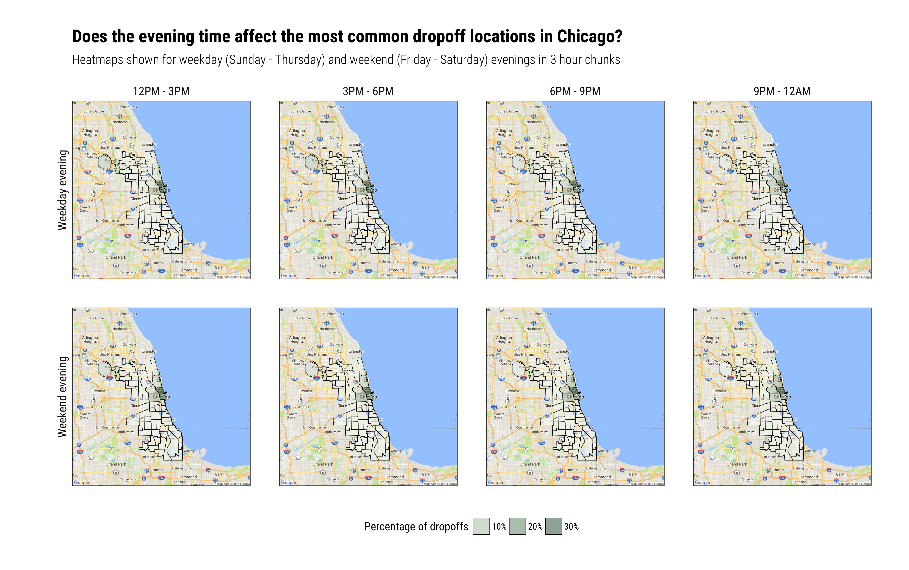
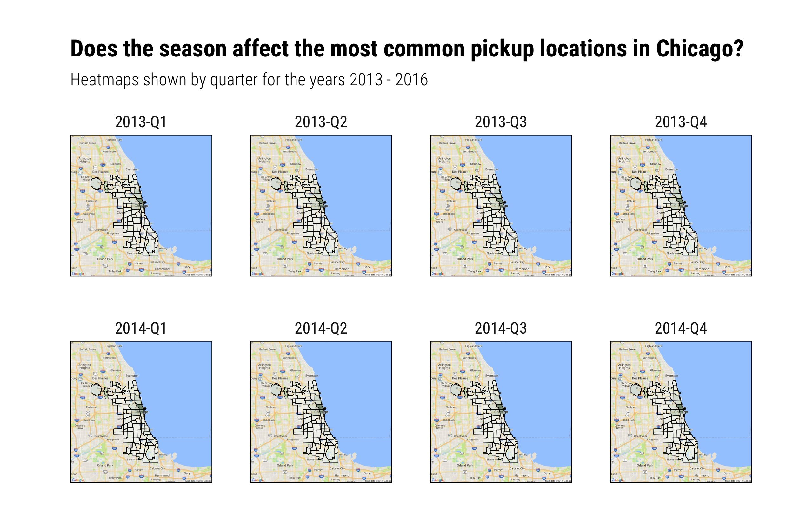

Processing 105 million taxi trips and visualizing it with ggmap
===============================================================

[](plots/evening-dropoffs.png)

[Andy](https://twitter.com/VizWizBI?lang=en) and his team had an interesting challenge for [week 6 of Makeover Monday](https://trimydata.com/2017/02/07/makeover-monday-week-6-2017-inside-chicagos-taxi-data/). The goal was to create a visualization that showed how Chicagoans use taxis to get around the city. The challenge to me was particularly interesting because it (1) involved a large amount of data (~42GB of trip records), requiring us to be a bit careful with how we approach it, and (2) is inherently spatial in nature. I'd been meaning to play with `R`'s [ggmap](https://github.com/dkahle/ggmap) package for a while now for just this sort of thing, so I thought this would be a great chance to try it out.

What follows is a tutorial for using `ggmap` (plus a bit of `RSQLite` and `rgdal`) to spatially visualize data.

[Primary R script used for this analysis](scripts/pickups.R)

-   [Introduction](#introduction)
-   [A. Querying the count data](#querying-the-count-data)
-   [B. Loading the spatial data](#loading-the-spatial-data)
-   [C. Merging the count and spatial data](#merging-the-count-and-spatial-data)
-   [D. Building the plot](#building-the-plot)

Introduction
------------

### General precursory thoughts for handling a dataset of this size

The first thing to realize about working with a dataset this big is that we don't need to load *all of it* (i.e. every record) for the analysis we're interested in doing. Rather, we just need some subset or aggregation of it. This is good, because the subset / aggregation we're interested in is likely (or more likely, at least) to fit into memory, which gives us a chance to analyze it with our usual tools. To me, the most natural thing to do in this situation is to import the data into a database, like [SQLite](https://www.sqlite.org/cli.html). Once there, we can execute queries for the particular subset / aggregation we need, and then boom, we're off to the races. There are a lot of nice tutorials about initializing the database (e.g. item 8 in the SQLite link above) and interacting with it from `R` (like [Hadley Wickham's tutorial](https://cran.r-project.org/web/packages/RSQLite/vignettes/RSQLite.html)), so I'm not going to spend much time working through these things here.

### Getting acquainted with the data

[The dataset that we'll be working with](https://data.cityofchicago.org/Transportation/Taxi-Trips/wrvz-psew) is essentially a logfile of taxi trips. Each record holds information about a single trip, and contains fields like the pickup time, pickup area, dropoff time, dropoff area, total fare, and so on. Below are the first five rows and a few columns to give you a sense of its structure.

    ##     Trip Start Timestamp Pickup Community Area Trip Miles   Fare
    ## 1 04/06/2016 08:45:00 PM                     8        0.1  $8.75
    ## 2 10/22/2013 08:45:00 PM                    32          0 $15.25
    ## 3 09/21/2013 04:30:00 PM                                0 $12.65
    ## 4 08/14/2014 12:45:00 AM                     8        1.8 $57.85
    ## 5 07/21/2014 12:45:00 PM                     7        5.5 $15.25

### Answering a particular question: what are the most common pickup locations in Chicago?

One angle that I was interested in exploring was to see which locations are the most popular for taxi pickups. Since the city has such cold winters, I was also curious about whether these locations remain the most popular throughout the seasons. We'll build up a visualization with `ggmap` + `ggplot2` to answer this.

<a name="querying-the-count-data"/> A. Querying the count data </a>
-------------------------------------------------------------------

Querying the data for this is pretty simple to do. We just need to get the `COUNT` of pickups per `Pickup Community Area`, per say each quarter, so that we can study the trend over time. SQL's `GROUP BY` makes this easy to do:

``` r
con = dbConnect(RSQLite::SQLite(), dbname = "../data/taxi.db")

query = ('SELECT "Pickup Community Area" AS area_no, 
          PRINTF("%s-%s", SUBSTR("Trip Start Timestamp", 7, 4),
                          SUBSTR("Trip Start Timestamp", 1, 2))
          AS period,
          COUNT(*) AS count
          FROM (SELECT * FROM taxi LIMIT 1000)
          WHERE area_no != "" AND period != ""
          GROUP BY period, area_no')

df_pick = dbGetQuery(con, query)
```

**Note that in the query above, I'm not grouping the counts by quarter, but by month and year**. SQLite doesn't have great support for datetime data, so I figured it'd be easier to extract the counts this way first, and then use `R`'s functionality to get the quarter-based numbers we're looking for. At this point, the data in `df_pick` looks something like like this:

    ##   area_no  period count
    ## 1       2 2013-01     1
    ## 2      22 2013-01     1
    ## 3      24 2013-01     1
    ## 4      28 2013-01     7
    ## 5       3 2013-01     3
    ## 6      31 2013-01     1

Converting to quarter-based counts is pretty easy to do -- we just replace each `YYYY-MM` date with a `YYYY-Q` date and sum up the counts that now belong to the same period. I do this with the below code (which note also converts the quarter based counts to percentages). Nothing fancy going on here, just adding things up.

``` r
# convert to quarters
df_pick$period = lubridate::quarter(as.Date(sprintf("%s-01", df_pick$period)), 
                                    with_year = TRUE)

# sum up counts that now belong to the same (quarter, community area)
df_pick = plyr::ddply(df_pick, c("period", "area_no"), my_sum)

# convert counts to percent
df_pick = plyr::ddply(df_pick, "period", my_percent)

# reformat quarters for readability
df_pick$period = stringr::str_replace(df_pick$period, "\\.", "-Q")
```

At this point, our data is structured like the small subset below. Each record represents the percentage of pickups that occured at the indicated `area_no` in that `period` (quarter) of time. We now have the "count" data we need -- the next step is to connect it with spatial information so that we can visualize it with `ggmap`.

    ##    period area_no     percent
    ## 1 2013-Q1       1 0.004415011
    ## 2 2013-Q1      14 0.002207506
    ## 3 2013-Q1      15 0.004415011
    ## 4 2013-Q1      16 0.002207506
    ## 5 2013-Q1       2 0.004415011
    ## 6 2013-Q1      21 0.002207506

<a name="loading-the-spatial-data"/> B. Loading the spatial data </a>
---------------------------------------------------------------------

Spatial information for the [city of Chicago can be downloaded here](https://data.cityofchicago.org/Facilities-Geographic-Boundaries/Boundaries-Community-Areas-current-/cauq-8yn6) (be sure to download it as a `shapefile`). Before we get into the details of this data, just know that it contains boundary information for each of the `Pickup Community Areas` that were returned from our query. This boundary information is important; we'll need it to outline each of the communities on our map.

The `shapefile` that we downloaded isn't actually a single file, but a zip containing four files: a `.shp`, `.shx`, `.dbf` and `.prj`. The `.shp` is the most important, as it contains the actual "geometry" (outline) of the communities. The others aren't as important, but if you're interested, you can see the [Wikipedia page](https://en.wikipedia.org/wiki/Shapefile) for details on the file structure.

We can load the spatial data into `R` using the `readOGR` function from the `rgdal` package.

``` r
sp_comm = readOGR("data/", "community-area")
```

The data that we loaded looks a bit nasty at first glance:

``` r
print(str(sp_comm, list.len = 2))
```

    ## Formal class 'SpatialPolygonsDataFrame' [package "sp"] with 5 slots
    ##   ..@ data       :'data.frame':  77 obs. of  9 variables:
    ##   .. ..$ perimeter : num [1:77] 0 0 0 0 0 0 0 0 0 0 ...
    ##   .. ..$ community : Factor w/ 77 levels "ALBANY PARK",..: 18 56 26 29 37 40 69 34 77 61 ...
    ##   .. .. [list output truncated]
    ##   ..@ polygons   :List of 77
    ##   .. ..$ :Formal class 'Polygons' [package "sp"] with 5 slots
    ##   .. .. .. ..@ Polygons :List of 1
    ##   .. .. .. .. ..$ :Formal class 'Polygon' [package "sp"] with 5 slots
    ##   .. .. .. .. .. .. ..@ labpt  : num [1:2] -87.6 41.8
    ##   .. .. .. .. .. .. ..@ area   : num 0.000463
    ##   .. .. .. .. .. .. .. [list output truncated]
    ##   .. .. .. ..@ plotOrder: int 1
    ##   .. .. .. .. [list output truncated]
    ##   .. ..$ :Formal class 'Polygons' [package "sp"] with 5 slots
    ##   .. .. .. ..@ Polygons :List of 1
    ##   .. .. .. .. ..$ :Formal class 'Polygon' [package "sp"] with 5 slots
    ##   .. .. .. .. .. .. ..@ labpt  : num [1:2] -87.6 41.8
    ##   .. .. .. .. .. .. ..@ area   : num 0.00017
    ##   .. .. .. .. .. .. .. [list output truncated]
    ##   .. .. .. ..@ plotOrder: int 1
    ##   .. .. .. .. [list output truncated]
    ##   .. .. [list output truncated]
    ##   .. [list output truncated]
    ## NULL

But it actually has a fairly reasonable structure. We'll make use of two slots from this object:

1.  **The `data` slot**. It's of class `data.frame` and holds information about each community's geographic information, like its `shape_area` and `shape_len`. Note it has 77 rows, one for each community.
2.  **The `polygons` slot**. It's of class `list` and holds `Polygon` objects. Each `Polygon` contains a `coords` matrix that lists the (longitude, latitude) pairs that trace its boundary. Note that there are 77 of these as well; this is the case because each one corresponds to a community from `data`. They match in terms of offset, so the first community in `data` maps to the first `Polygon`, the second community to the second `Polygon`, and so forth.

We need to extract the `coords` information from each `Polygon` and link it to the community it represents so that we can draw them properly on our map. I do this with the `extract_community_area_data` function below. It works by iterating over each row in `data` and each `Polygon` in the `polygons` list and storing the `coords` information in an organized `data.frame`. This is important, because we need this data to be structured in a useable form for when we incorporate it with the "count" data we queried in step A.

``` r
extract_community_area_data = function(spdf) {
  # function to convert the 'SpatialPolygonsDataFrame'
  # into something useable for ggplot
  #
  # Args:
  #   spdf: SpatialPolygonsDataFrame (objected returned from readOGR)
  #
  # Returns: data.frame

  # extract the 'data' and 'polygons' slots from the object
  df_comm = spdf@data
  l_polys = spdf@polygons
  
  # init list to hold output
  l_dfs = vector("list", length = length(l_polys))
  
  # extract number + name + polygon coords for each community area
  for (i in seq_along(l_polys)) {
    
    p_poly = l_polys[[i]]
    m_cord = p_poly@Polygons[[1]]@coords # oddly, p_poly@Polygons is of type list;
                                         # to access its data members you need to first index 
                                         # to the first element
    
    l_dfs[[i]] = data.frame("area_no" = rep(as.character(df_comm$area_numbe)[i], nrow(m_cord)),
                            "area_nm" = rep(as.character(df_comm$community)[i], nrow(m_cord)),
                            "lon" = m_cord[, 1],
                            "lat" = m_cord[, 2],
                            "order" = seq_len(nrow(m_cord)),
                            stringsAsFactors = FALSE)
  }
  
  return(plyr::rbind.fill(l_dfs))
}
```

Running this function on `sp_comm` gives us the following output:

``` r
df_comm = extract_community_area_data(sp_comm)

print(head(df_comm))
```

    ##   area_no area_nm       lon      lat order
    ## 1      35 DOUGLAS -87.60914 41.84469     1
    ## 2      35 DOUGLAS -87.60915 41.84466     2
    ## 3      35 DOUGLAS -87.60916 41.84459     3
    ## 4      35 DOUGLAS -87.60917 41.84452     4
    ## 5      35 DOUGLAS -87.60917 41.84446     5
    ## 6      35 DOUGLAS -87.60915 41.84424     6

This object lists the (longitude, latitude) pairs that trace each community area. Note also that there is an `order` column, which specifies the order in which the points need to be "drawn" so that they properly outline the community area on a map.

Ok, we now have the spatial data we need, in a form that'll be easy to integrate with the count data we queried in part A.

**Side Note:** I think it's important to understand the structure of the object returned from `readOGR`. If you're not interested in toying with this and are looking for a shortcut, look into `ggplot`'s `fortify` function. It will return a `data.frame` that's pretty similar to what we get from `extract_community_area_data`.

<a name="merging-the-count-and-spatial-data"/> C. Merging the count and spatial data </a>
-----------------------------------------------------------------------------------------

So far, we've constructed two data frames: `df_pick` which lists the number of taxi pickups per community area and period of time, and `df_comm`, which lists the longitude and latitude coordinates that enclose each community area. See below for a reminder on how these are structured.

``` r
print(head(df_pick)); print(head(df_comm))
```

    ##    period area_no     percent
    ## 1 2013-Q1       1 0.004415011
    ## 2 2013-Q1      14 0.002207506
    ## 3 2013-Q1      15 0.004415011
    ## 4 2013-Q1      16 0.002207506
    ## 5 2013-Q1       2 0.004415011
    ## 6 2013-Q1      21 0.002207506

    ##   area_no area_nm       lon      lat order
    ## 1      35 DOUGLAS -87.60914 41.84469     1
    ## 2      35 DOUGLAS -87.60915 41.84466     2
    ## 3      35 DOUGLAS -87.60916 41.84459     3
    ## 4      35 DOUGLAS -87.60917 41.84452     4
    ## 5      35 DOUGLAS -87.60917 41.84446     5
    ## 6      35 DOUGLAS -87.60915 41.84424     6

Remember that the goal is to spatially visualize the most popular pickup areas across time. If you put your `ggplot` goggles on for a moment, you can image that to do this we're going to need to "facet" on the period of time, and draw the polygons representing each community area per facet.

In my opinion, the best way to ready our data for this type of operation is to conduct a join of `df_pick` and `df_comm`, so that we have both the count and longitude / latitude data in one place. We can accomplish this fairly easily with the built-in `merge` function.

``` r
# merge the two data.frames
df_pick = merge(df_pick, df_comm, by.x = "area_no", by.y = "area_no")

# order it by `order` so when we facet the polygons are drawn correctly
df_pick = df_pick[order(df_pick$order), ]

print(head(df_pick))
```

    ##      area_no  period     percent     area_nm       lon      lat order
    ## 496        1 2013-Q1 0.004415011 ROGERS PARK -87.65456 41.99817     1
    ## 1422       1 2014-Q2 0.007173601 ROGERS PARK -87.65456 41.99817     1
    ## 2348       1 2015-Q1 0.003200000 ROGERS PARK -87.65456 41.99817     1
    ## 3274       1 2016-Q2 0.008064516 ROGERS PARK -87.65456 41.99817     1
    ## 4200       1 2014-Q4 0.004518072 ROGERS PARK -87.65456 41.99817     1
    ## 5126       1 2013-Q4 0.003210273 ROGERS PARK -87.65456 41.99817     1

Each of the records in `df_pick` has now been "duplicated" c(i) times, where c(i) is the number of (longitude, latitude) points needed to outline the community record i speaks to. Note also that we ordered the data by the `order` column, so that the polygons will be drawn correctly once we do the facet.

<a name="building-the-plot"/> D. Building the plot </a>
-------------------------------------------------------

Once the data is organized properly, it's pretty easy to build the visual we're looking for. We first
1. Pull-in a map of Chicago using `ggmap`'s `get_googlemap` function call
2. Convert this to a `ggplot` object using the `ggmap::ggmap` function, setting our data to the `base_layer` in the process
3. Draw `geom_polygons` for each community area, filling them with the percentage of pickups they account for (scaling the color with the help of `scale_fill_gradient`), and
4. `facet_wrap`'ing on `period` to show this visualization per quarter

``` r
ggm_chi = get_googlemap("Chicago, Illinois", zoom = 10, maptype = "roadmap")

ggp_chi = ggmap(ggm_chi, base_layer = ggplot(df_pick, aes_string("lon", "lat")), 
                maprange = TRUE, extent = "device")

ggp_chi = ggp_chi + geom_polygon(aes_string(group = "area_no", fill = "percent"),
                                 color = "black", size = 0.2, alpha = 0.5)

ggp_chi = ggp_chi + scale_fill_gradient(name = "Percentage of pickups",
                                        labels = scales::percent,
                                        low = "#f7fcf5", high = "#00441b",
                                        guide = "legend")

ggp_chi = ggp_chi + facet_wrap("period", ncol = 4)
```

From here, I modify a few aesthetics to get things looking a bit sharper. Kudos to [hrbrmstr](https://twitter.com/hrbrmstr?lang=en) for developing the [hrbrthemes package](https://github.com/hrbrmstr/hrbrthemes); I use its `theme_impsum_rc` theme to get a nice clean look.

``` r
ggp_chi = ggp_chi + hrbrthemes::theme_ipsum_rc()

ggp_chi = ggp_chi + labs(x = "", y = "")
ggp_chi = ggp_chi + labs(title = paste("Does the season affect the most",
                                       "common pickup locations in Chicago?"))

ggp_chi = ggp_chi + labs(subtitle = "Heatmaps shown by quarter for the years 2013 - 2016")

ggp_chi = ggp_chi + theme(legend.position = "bottom")
ggp_chi = ggp_chi + theme(axis.text = element_blank())
ggp_chi = ggp_chi + theme(strip.text = element_text(hjust = 0.5))
ggp_chi = ggp_chi + theme(panel.border = element_rect(color = "black", fill = NA))
```

The image below shows the plot over the first few facets of data. Click it to see the full image, with facets for every period. Looking at the image, we don't see taxi pickup patterns changing too much -- they seem to cluster in the "LOOP" community and its surrounding area, regardless of the season (and hence if it's warm or cold). Hmph! Looks like folks in Chicago don't change their patterns as much as I thought, considering the weather they see. Not what I would've thought.

[](crop/pickups-small.png)

We can play the same game (making small modifications to our query) to see the areas that are the most common for dropoffs each quarter.

[](plots/dropoffs.png)

Or do it to see the dropoffs that are most common in the evenings, weekdays versus weekends.

[](plots/evening-dropoffs.png)

We again don't see much changing here -- it looks like the popular areas in Chicago *remain* popular, regardless of when we look at the taxi trips coming / going.

If you'd like to try anything yourself, feel free to clone the repository. A sample of the data (listed as `sample.csv` plus the `shapefile` for the community areas can be found in the `data/` folder. You'll have to modify your "query" slightly since you would no longer be pulling from a database, but it shouldn't take much to get up and running ( `sqldf`'s `read.csv.sql` function should be helpful here). Hope you find it useful!
